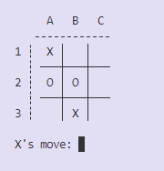

<a name="readme-top"></a>

<div align="center">
    
    <br/>
    <h3><b>Tic Tac Toe by Python</b></h3>
</div>

# 📗 Table of Contents

- [📖 About the Project](#about-project)
  - [🛠 Built With](#built-with)
    - [Tech Stack](#tech-stack)
    - [Key Features](#key-features)
- [💻 Getting Started](#getting-started)
  - [Setup](#setup)
  - [Prerequisites](#prerequisites)
  - [Install](#install)
  - [Usage](#usage)
  - [Run tests](#run-tests)
- [👥 Authors](#authors)
- [🔭 Future Features](#future-features)
- [🤝 Contributing](#contributing)
- [⭐️ Show your support](#support)
- [🙏 Acknowledgements](#acknowledgements)
- [❓ FAQ (OPTIONAL)](#faq)
- [📝 License](#license)

# 📖 [School Library App] <a name="about-project"></a>

**Tic Tac Toe by Python** is a console game application. This application runs on python the user can selection between different of 2 levels of computer AI. It is wrapped in a PIP package.

<p align="right">(<a href="#readme-top">back to top</a>)</p>

## 🛠 Built With <a name="built-with"></a>

### Tech Stack <a name="tech-stack"></a>

<details>
    <summary>Programming Language</summary>
    <ul>
        <li><a href="https://www.python.org/">Python</a></li>
    </ul>
</details>

### Key Features <a name="key-features"></a>

- **Separation of responsabilities**
- **Minimax algorithmm implemented as basic AI**
- **Implement CLI commands**
- **Docstrings and docpage implement - Google standard and MkDocs**

<p align="right">(<a href="#readme-top">back to top</a>)</p>

## 💻 Getting Started <a name="getting-started"></a>

### Prerequisites

In order to run this project you need:
- To clone or fork this repo
- Python installed in your machine
- It is recommended to use a virtual environment

For more information on how to install ruby on your machine:
- <a href="https://www.python.org/downloads/">How to install Python</a>

### Setup

Clone this repository to your desired folder:

For example, using Ubuntu:

```sh
  cd my-desired-folder
  git clone https://github.com/lordksix/tic-tac-toe-python
```

For more information on how to clone or fork a repository:
- <a href="https://docs.github.com/en/repositories/creating-and-managing-repositories/cloning-a-repository">How to clone a repo</a>
- <a href="https://docs.github.com/en/get-started/quickstart/fork-a-repo">How to fork a repo</a>


### Install

To install dependencies, the following command must be run in the terminal:

```sh
  cd tic-tac-toe-python
  python -m pip install tic-tac-toe
```

### Usage

In the project directory, you can run:

```sh
  tictactoe
```
For further informacion read the [docs](https://lordksix.github.io/tic-tac-toe-python/)

<div align="center">
    
    <br/>
    <p><b>Game UI</b></p>
</div>

### Run tests

Tests to be implemented

<p align="right">(<a href="#readme-top">back to top</a>)</p>

## 👥 Authors <a name="authors"></a>

👤 **lordksix**

- GitHub: [@lordksix](https://github.com/lordksix)
- LinkedIn: [@wladpasquel](https://www.linkedin.com/in/wladpasquel/)
- Medium: [@wladimir.pasquel](https://medium.com/@wladimir.pasquel)

<p align="right">(<a href="#readme-top">back to top</a>)</p>

## 🔭 Future Features <a name="future-features"></a>

Future changes:
- Implementation of tests

<p align="right">(<a href="#readme-top">back to top</a>)</p>

## 🤝 Contributing <a name="contributing"></a>

Contributions, issues, and feature requests are welcome!

Feel free to check the [issues page](../../issues/).

<p align="right">(<a href="#readme-top">back to top</a>)</p>

## ⭐️ Show your support <a name="support"></a>

If you like this project, I encourage you to clone, fork and contribute. Our community and knowledge grows with each engagement.

<p align="right">(<a href="#readme-top">back to top</a>)</p>

## 🙏 Acknowledgments <a name="acknowledgements"></a>

I want to thank RealPython for the help, base and inspiration.

<p align="right">(<a href="#readme-top">back to top</a>)</p>

## ❓ FAQ <a name="faq"></a>

- **Do I need a IDE or a special text editor to make changes?**

  - No, you don't. You can use NotePad to make changes.

<p align="right">(<a href="#readme-top">back to top</a>)</p>

## 📝 License <a name="license"></a>

This project is [GNU v3](./LICENSE) licensed.

<p align="right">(<a href="#readme-top">back to top</a>)</p>

